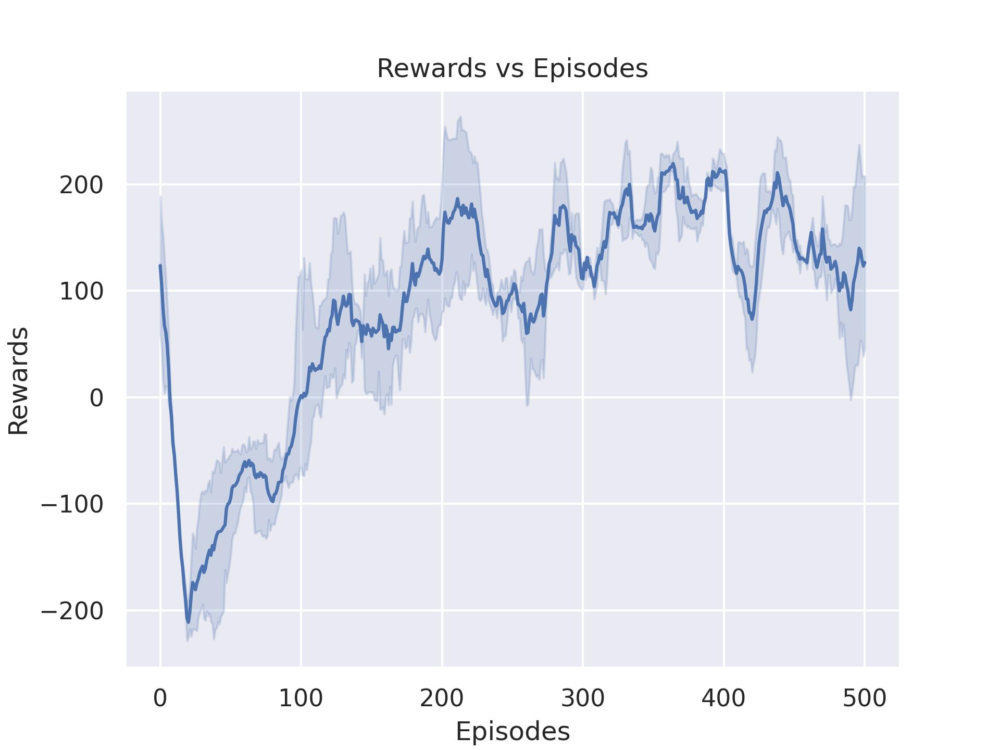
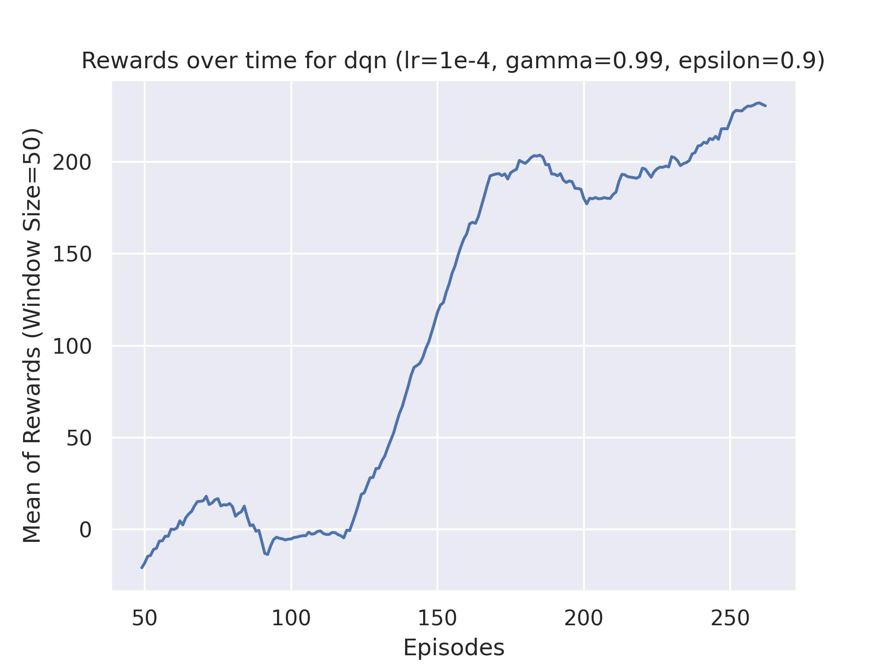
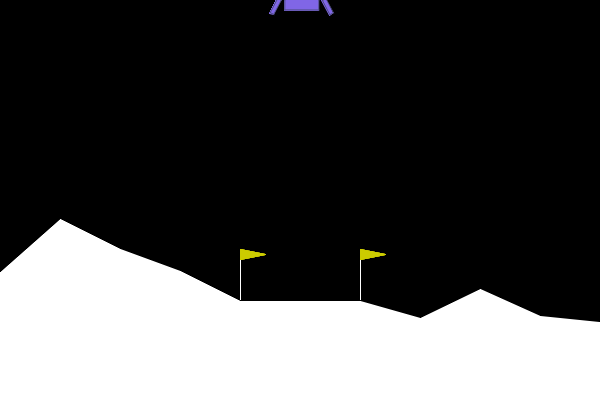
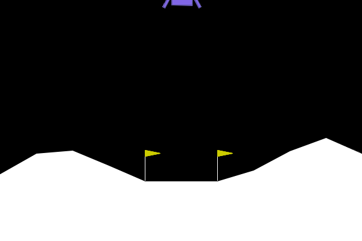
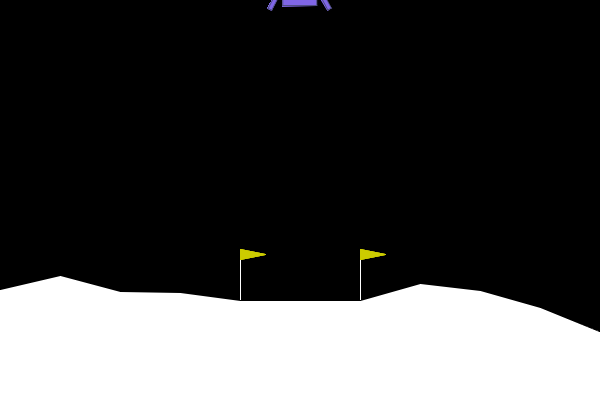
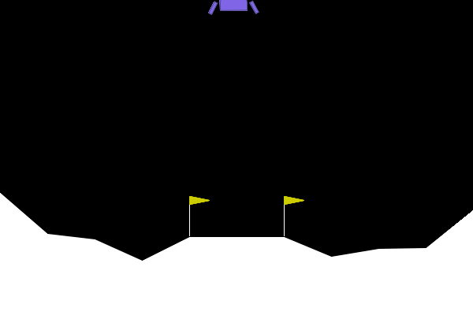

# Lunar Lander Project - Droneiros de Cabreúva

Welcome to the Lunar Lander Project by Droneiros de Cabreúva, where we tackle the classic rocket trajectory optimization challenge with innovative solutions and collaborative effort.

## Our Contributors

<table>
  <tr>
    <td align="center"><a href="https://github.com/RicardoRibeiroRodrigues"> <b>Ricardo Ribeiro Rodrigues</b></a> Developer</td>
    <td align="center"><a href="https://github.com/Pedro2712"> <b>Pedro Andrade</b></a> Developer</td>
    <td align="center"><a href="https://github.com/JorasOliveira"> <b>Jorás Oliveira</b></a> Developer</td>
    <td align="center"><a href="https://github.com/renatex333"> <b>Renato Almeida</b></a> Developer</td>
  </tr>
</table>

## Overview
In this project, we engage with the Lunar Lander simulation from [Farama Foundation Gymnasium](https://gymnasium.farama.org/environments/box2d/lunar_lander/). Our goal is to develop and refine algorithms that ensure a safe and controlled landing on the moon's surface. Through iterative design and testing, our team seeks to optimize lander performance using various control strategies and AI techniques.

  

### Problem Description
In this environment, an agent controls the lander by making continuous adjustments to its position and velocity. The objective is to land the craft between two flags on the surface with minimal fuel usage, avoiding crashes and hard landings. Successful landings and specific maneuvers, like coming to a rest near the landing zone, are rewarded, while excessive fuel usage and crashing are penalized.

### Action Space
The action space consists of four discrete actions:
- 0: Do nothing
- 1: Fire the left orientation engine
- 2: Fire the main engine
- 3: Fire the right orientation engine

These actions allow the agent to control the lander's lateral movements and vertical thrust.

### Observation Space
The observation space is an 8-dimensional vector representing various aspects of the lander's state, including horizontal ($x$) and vertical ($y$) position, horizontal and vertical linear velocity, lander angle and angular velocity, and two booleans indicating whether each leg is in contact with the ground.

## Comparison: Deep Q-Learning vs DQN (Deep Q-Networks)

In this project, we have implemented both Deep Q-Learning and DQN (Deep Q-Networks) algorithms to address the challenge of landing a spacecraft in the Lunar Lander environment. Through the application of Deep Q-Learning, we explored the fundamental approach of utilizing deep neural networks to approximate the Q-value function, allowing the agent to predict the value of its actions in various states. This method laid the groundwork for our further exploration with the DQN algorithm, which builds upon Deep Q-Learning by introducing critical innovations such as experience replay and fixed Q-targets.

By comparing these two algorithms, we not only gauged the impact of advanced techniques like experience replay on the learning efficiency and stability but also demonstrated the evolution of reinforcement learning strategies from basic Q-Learning to sophisticated architectures like DQN. The implementation of both algorithms provided valuable insights into the dynamics of reinforcement learning and its application in complex environments such as lunar landing.

### Learning Curves

The learning curve above demonstrates the agent's performance over time, measured in terms of average reward per episode. Initially, the agent struggles to achieve successful landings, often incurring penalties for crashes or excessive fuel consumption. Over time, as the agent learns from its experiences, we observe a positive trend in performance, with increased rewards indicating more successful and efficient landings.

### Agent Demonstrations

Here are two animations showing the agent trained using Deep Q-Learning algorithm in action:

- Initial Stages of Learning:
  

  

- After Training Completion:

  

Here are two animations showing the agent trained using DQN algorithm in action:

- Initial Stages of Learning:
  

  

- After Training Completion:

  

  

These GIFs illustrate the progression from an inexperienced agent to a skilled one, capable of handling the complexities of lunar landing.

### Conclusion

It is clear that in both algorithms, the agents were able to learn and specialize in their tasks. However, the Deep Q-Network (DQN) outperformed Deep Q-Learning (DQL) since, in the comparison of the Reward vs. Episode curves, the DQN converged in far fewer episodes, sometimes even in half the number of episodes required by DQL, and also achieved a higher average reward than DQL.

The reason the Deep Q-Network (DQN) might perform better than basic Deep Q-Learning could be due to two main improvements in DQN. First, DQN uses a technique called experience replay, where it saves previous experiences and learns from them randomly. This helps the system to learn from a wide variety of past situations, making learning more efficient. Second, DQN uses what's called a target network, which is a separate network that helps in making the learning process more stable. These two features help DQN learn faster and achieve better results compared to traditional Deep Q-Learning.

## References

